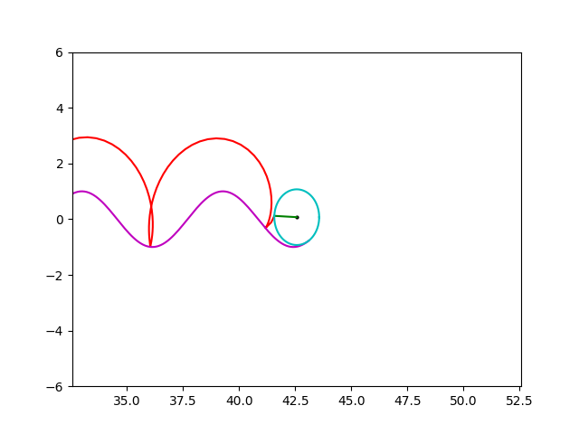

# Cycloids

This is one of my first scripts written in Python, a script that animates cycloids rolling over a function, such as `sin(x)`. The goal was to visualize cycloids and how they behave when rolling over different curves.

The default example is a cycloid rolling over the function `sin(x)`.



## How It Works

- The script uses `matplotlib` to create an animation of a rolling circle tracing a cycloid.
- The circle rolls over a curve defined by any function of `x`, such as `sin(x)`, `cos(x)`.
- It calculates the cycloid path by simulating the rolling motion and updates the plot in real-time.

## Usage

1. Install required dependencies:
   ```bash
   pip install numpy matplotlib scipy sympy
   ```
2. Run the script:
   ```bash
   python main.py
    ```