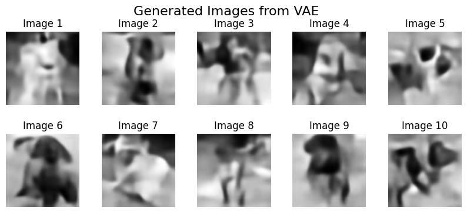

# Variational Autoencoder for Dog Image Reconstruction

This notebook was created for a university course, where the challenge was to develop a variational autoencoder (VAE) architecture that accurately reconstructs images of dogs and generates new dog images from random noise sampled from a normal distribution (mean = 0, variance = 1). 

Despite the architecture not being highly advanced, it was one of the successful submissions, earning additional points for effort and aesthetics.

**Notebook language**: Polish

**Framework**: Pytorch

**Authors**:
- [juniorkowal](https://github.com/juniorkowal)
- [Og4rek](https://github.com/Og4rek)

