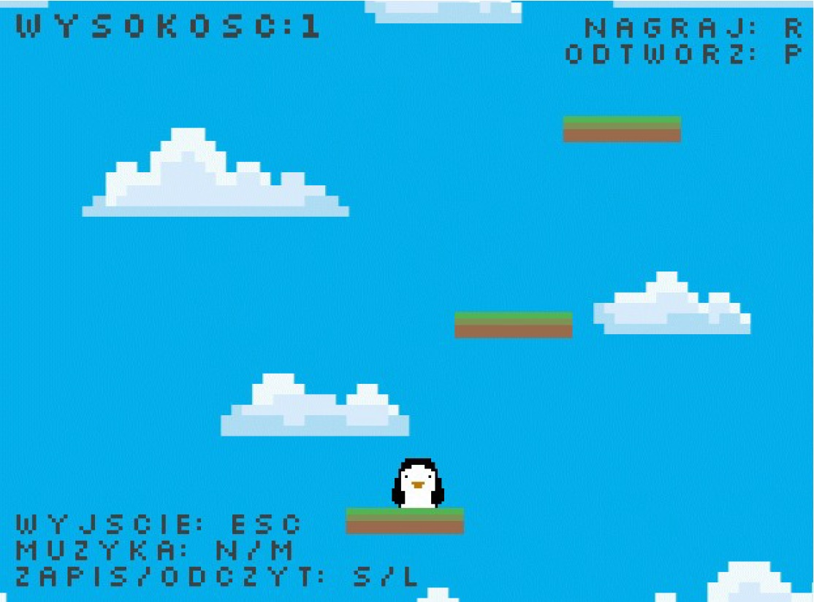

# Icy Tower - Java Clone

## Overview
A clone of the arcade game **Icy Tower**, built with Java. Uses standard Java libraries.

**UI Language**: Polish  



## Setup
1. Navigate to the `icy-tower-clone` directory.
2. Compile the source files:
   ```bash
   javac -d bin src/*.java
   ```
3. Run the game:
   ```bash
   java -cp bin/ World
   ```

## Controls
- **Esc**: Quit
- **Space**: Jump
- **Left/Right**: Move
- **N**: No music
- **M**: Volume up
- **S**: Save progress
- **L**: Load progress
- **R**: Record gameplay
- **P**: Play recorded session

## Notes
- **Graphics**: Custom-made.
- **Sound**: AI-generated.
- **Difficulty**: Increases with height; platforms become shorter.

