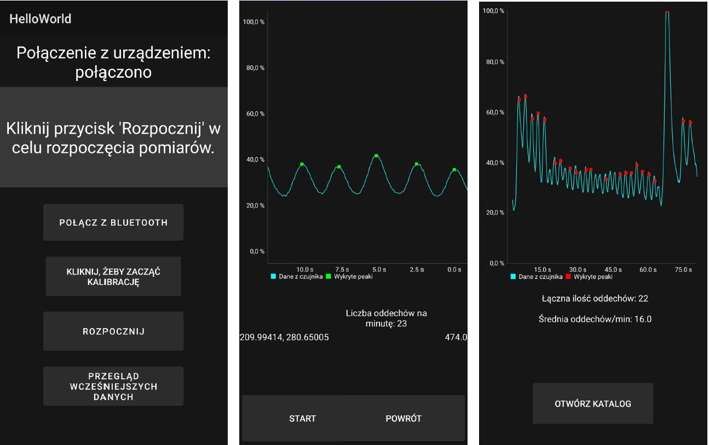

# Respiratory Rate App

This Android application connects to a custom-made respiratory rate sensor via Bluetooth to collect real-time data on a user's respiratory rate and present it on the user interface.

**UI Language**: Polish  
**Project Purpose**: Developed as part of an engineering thesis.

## Authors
- [juniorkowal](https://github.com/juniorkowal)
- [MacJan222](https://github.com/MacJan222)

## Original Repository
[Original Repository Link](https://github.com/MacJan222/monitor_kotlina)
